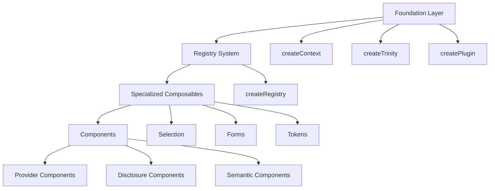
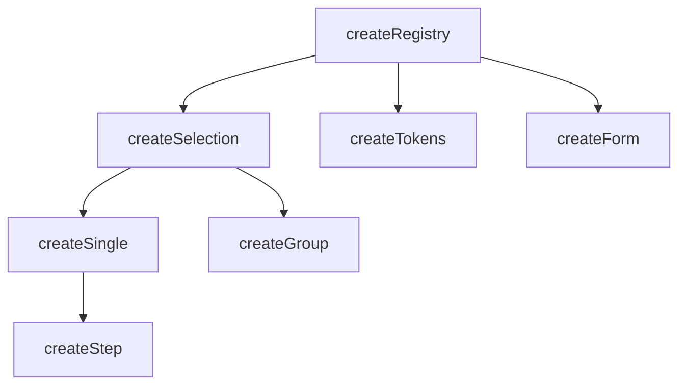
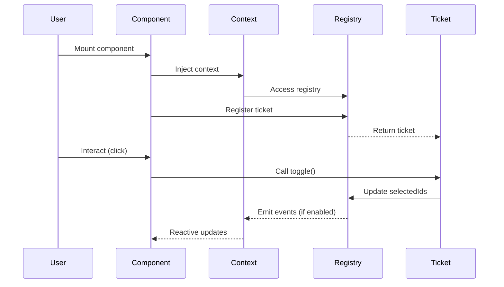

# Architecture

Vuetify Zero is built on a layered composable architecture where everything extends from a few foundational primitives. This design provides maximum flexibility while maintaining type safety and performance.

## System Overview

The framework consists of three primary layers:



## Package Structure

Vuetify Zero is organized as a monorepo with tree-shakeable exports:

```
@vuetify/v0/
├── components/     # Headless Vue components
├── composables/    # Vue composables
│   ├── createContext/
│   ├── createTrinity/
│   ├── createRegistry/
│   ├── createSelection/
│   ├── createSingle/
│   ├── createGroup/
│   ├── createStep/
│   ├── createForm/
│   ├── createTokens/
│   ├── useTheme/
│   ├── useLocale/
│   ├── useBreakpoints/
│   └── ...
├── utilities/      # Type guards, helpers
├── types/          # TypeScript definitions
├── constants/      # SSR-safe globals
└── date/           # Date adapter system
```

### Subpath Exports

Import only what you need for optimal tree-shaking:

```typescript
// Import everything (not recommended for production)
import { createSelection, Tabs } from '@vuetify/v0'

// Import by category (better tree-shaking)
import { createSelection } from '@vuetify/v0/composables'
import { Tabs } from '@vuetify/v0/components'
import { isObject } from '@vuetify/v0/utilities'
import { ID } from '@vuetify/v0/types'
import { IN_BROWSER } from '@vuetify/v0/constants'
```

## Foundation Layer

The foundation layer provides three core factories that all other composables build upon:

### createContext

Type-safe dependency injection wrapper around Vue's provide/inject:

```typescript
import { createContext } from '@vuetify/v0/composables'

interface ThemeContext {
  isDark: Ref<boolean>
  toggle: () => void
}

const [useTheme, provideTheme] = createContext<ThemeContext>('v0:theme')

// Provider component
const isDark = ref(false)
provideTheme({
  isDark,
  toggle: () => { isDark.value = !isDark.value }
})

// Consumer component
const theme = useTheme() // Throws if context not found
theme.toggle()
```

<Info>
  Unlike Vue's native `inject()` which returns `undefined` silently, `createContext` throws an error when context is missing, eliminating silent failures.
</Info>

### createTrinity

Creates the signature `[use, provide, default]` pattern used throughout v0:

```typescript
import { createContext, createTrinity } from '@vuetify/v0/composables'

const [useThemeContext, _provideThemeContext] = createContext<ThemeContext>('v0:theme')

const defaultTheme: ThemeContext = {
  isDark: ref(false),
  toggle: () => {}
}

function provideTheme(context: ThemeContext = defaultTheme, app?: App) {
  return _provideThemeContext(context, app)
}

// Returns readonly tuple: [useContext, provideContext, defaultContext]
const [useTheme, provideTheme, theme] = createTrinity(
  useThemeContext,
  provideTheme,
  defaultTheme
)
```

The trinity pattern provides three ways to access context:

1. **`useTheme()`** - Inject from ancestor component
2. **`provideTheme()`** - Provide to descendants (with defaults)
3. **`theme`** - Direct access without dependency injection (useful for testing)

### createPlugin

Vue plugin factory for app-level context provision:

```typescript
import { createPlugin } from '@vuetify/v0/composables'

const ThemePlugin = createPlugin({
  namespace: 'v0:theme',
  provide: (app) => {
    provideTheme(defaultTheme, app)
  },
  setup: (app) => {
    // Optional: Additional app configuration
  }
})

// Usage
app.use(ThemePlugin)
```

## Registry System

The registry is the foundational data structure that powers selection, forms, tokens, and more.

### Core Concept: Tickets

Every item in a registry is a "ticket" with these properties:

```typescript
interface RegistryTicket {
  id: ID                  // Unique identifier (string | number)
  index: number           // Position in registry
  value: unknown          // Associated data
  valueIsIndex: boolean   // True if value wasn't explicitly set
}
```

### Three-Way Lookup

Registries provide O(1) lookups in three ways:

```typescript
import { createRegistry } from '@vuetify/v0/composables'

const registry = createRegistry()

registry.register({ id: 'item-1', value: 'Apple' })
registry.register({ id: 'item-2', value: 'Banana' })
registry.register({ id: 'item-3', value: 'Apple' }) // Duplicate value

// 1. By ID (Map lookup)
registry.get('item-1')        // { id: 'item-1', index: 0, value: 'Apple', ... }

// 2. By Value (Catalog lookup - returns array of IDs)
registry.browse('Apple')      // ['item-1', 'item-3']

// 3. By Index (Directory lookup)
registry.lookup(0)            // 'item-1'
```

### Performance Optimization

Registries use lazy caching for collection methods:

```typescript
// First call builds cache
const keys = registry.keys()     // O(n)

// Subsequent calls return cached array
const keys2 = registry.keys()    // O(1)

// Cache invalidated on mutation
registry.register({ id: 'new' })
const keys3 = registry.keys()    // O(n) - rebuilds cache
```

<Accordion title="Registry Event System">
  Registries can emit events for all mutations when enabled:

  ```typescript
  const registry = createRegistry({ events: true })

  registry.on('register:ticket', (ticket) => {
    console.log('Registered:', ticket)
  })

  registry.on('unregister:ticket', (ticket) => {
    console.log('Unregistered:', ticket)
  })

  registry.register({ id: 'a' }) // Logs: Registered: { id: 'a', ... }
  ```

  Events are disabled by default for performance.
</Accordion>

## Composable Architecture

### Extension Chain

Most composables extend the registry system:



### Selection Composables

Selection composables add a reactive `Set` of selected IDs on top of the registry:

```typescript
import { createSelection, createSingle, createGroup } from '@vuetify/v0/composables'

// Base: Multi-selection
const selection = createSelection({ multiple: true })
selection.register({ id: 'a', value: 'Apple' })
selection.select('a')
selection.selectedIds // Set { 'a' }

// Single: Auto-clears previous selection
const tabs = createSingle({ mandatory: true })
tabs.register({ id: 'home' })
tabs.register({ id: 'about' })
tabs.select('home')
tabs.select('about')     // 'home' auto-unselected
tabs.selectedId.value    // 'about'

// Group: Tri-state with batch operations
const checkboxes = createGroup()
checkboxes.onboard([
  { id: 'a', value: 'Apple' },
  { id: 'b', value: 'Banana' }
])
checkboxes.selectAll()
checkboxes.isMixed.value     // false
checkboxes.select(['a'])     // Partial selection
checkboxes.isMixed.value     // true
```

### Plugin Composables

Plugin composables follow the trinity pattern and can be installed app-wide:

```typescript
import { createThemePlugin, useTheme } from '@vuetify/v0/composables'

// Install plugin
app.use(createThemePlugin({
  default: 'light',
  themes: {
    light: { /* ... */ },
    dark: { /* ... */ }
  }
}))

// Use anywhere in the app
const theme = useTheme()
theme.current.value  // 'light'
theme.cycle()        // Switch to 'dark'
```

## Component Architecture

All components follow the **compound component pattern** with context-driven architecture.

### Compound Components

Components consist of a Root and sub-components:

```vue
<script setup lang="ts">
  import { Tabs } from '@vuetify/v0/components'
  import { ref } from 'vue'

  const active = ref('overview')
</script>

<template>
  <Tabs.Root v-model="active">
    <Tabs.List>
      <Tabs.Item value="overview">Overview</Tabs.Item>
      <Tabs.Item value="api">API</Tabs.Item>
    </Tabs.List>
    
    <Tabs.Panel value="overview">
      <p>Overview content</p>
    </Tabs.Panel>
    
    <Tabs.Panel value="api">
      <p>API documentation</p>
    </Tabs.Panel>
  </Tabs.Root>
</template>
```

### Context Provision Pattern

The Root component creates and provides context to children:

```typescript
// Inside TabsRoot.vue
import { createSelectionContext } from '@vuetify/v0/composables'
import { useProxyModel } from '@vuetify/v0/composables'

const model = defineModel<string>()

const [, provideTabsControl, context] = createSelectionContext({
  namespace: 'v0:tabs',
  mandatory: true,
  multiple: false
})

provideTabsControl(context)

// Bridge selection to v-model
useProxyModel(context, model, { multiple: false })
```

### Item Registration

Child components consume context and register themselves:

```typescript
// Inside TabsItem.vue
import { useContext } from '@vuetify/v0/composables'

const props = defineProps<{ value: string }>()

const tabs = useContext<SelectionContext>('v0:tabs')
const ticket = tabs.register({
  id: useId(),
  value: props.value
})
```

## Data Flow

Understanding how data flows through the architecture:



## TypeScript Integration

The entire architecture is fully typed with generics for extensibility:

```typescript
import type { RegistryTicketInput, RegistryTicket } from '@vuetify/v0/composables'

// Extend ticket type with custom properties
interface CustomTicketInput extends RegistryTicketInput {
  label: string
  disabled?: boolean
  metadata?: Record<string, unknown>
}

type CustomTicket = RegistryTicket & CustomTicketInput

// Type-safe registry
const registry = createRegistry<CustomTicketInput, CustomTicket>()

registry.register({
  label: 'My Item',
  disabled: false,
  metadata: { foo: 'bar' }
})

const ticket = registry.get('...')
ticket?.label      // string
ticket?.disabled   // boolean | undefined
ticket?.metadata   // Record<string, unknown> | undefined
```

## Performance Considerations

### Minimal Reactivity

v0 uses **shallow reactivity** by default for performance:

```typescript
// Registry collections are NOT reactive by default
const items = registry.values() // Snapshot

// Selection state IS reactive
const selection = createSelection()
selection.selectedIds // Reactive Set

// Make registry reactive if needed
const registry = createRegistry({ reactive: true })
```

### Batch Operations

Registries support batching for bulk operations:

```typescript
const registry = createRegistry({ events: true })

// Without batch: N cache invalidations + N events
for (const item of items) {
  registry.register(item)
}

// With batch: 1 cache invalidation + N events (after completion)
registry.batch(() => {
  for (const item of items) {
    registry.register(item)
  }
})

// Or use onboard() which uses batch internally
registry.onboard(items)
```

### Tree-Shaking

The package structure enables aggressive tree-shaking:

- Each composable in its own directory
- Subpath exports for category-level imports
- No side effects in module scope
- Pure function exports

## SSR Considerations

Vuetify Zero is designed for SSR compatibility:

```typescript
import { IN_BROWSER } from '@vuetify/v0/constants'

// SSR-safe browser detection
if (IN_BROWSER) {
  // Browser-only code
  window.addEventListener('resize', handler)
}

// SSR-safe ID generation
import { useId } from '@vuetify/v0/utilities'
const id = useId() // Uses Vue's useId in components, counter fallback elsewhere
```

<Note>
  All composables are SSR-safe and can be used during server-side rendering. Browser-specific functionality is guarded with `IN_BROWSER` checks.
</Note>

## Summary

Vuetify Zero's architecture is built on these principles:

1. **Foundation Layer** - Three core factories (createContext, createTrinity, createPlugin)
2. **Registry System** - Enhanced Map with three-way lookup and caching
3. **Extension Chain** - Specialized composables extend the registry
4. **Compound Components** - Context-driven component composition
5. **Type Safety** - Full TypeScript support with generic extensibility
6. **Performance** - Minimal reactivity, lazy caching, batch operations
7. **Tree-Shaking** - Subpath exports and pure functions
8. **SSR Compatible** - Guards for browser-specific code

This architecture provides maximum flexibility while maintaining excellent performance and developer experience.
