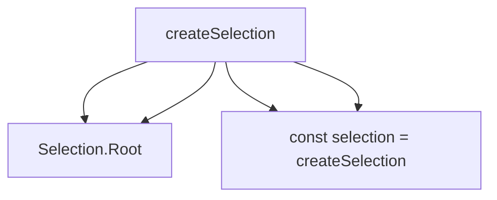

# Design Principles

Vuetify Zero is built on five core principles that guide every architectural decision. Understanding these principles helps you make the most of the framework.

## 1. Headless First

**Principle**: Separate behavior from presentation. Provide logic and accessibility without imposing styles.

### What This Means

Components provide:
- ✅ State management
- ✅ Accessibility (ARIA attributes, keyboard navigation)
- ✅ Focus management
- ✅ Event handling

Components do NOT provide:
- ❌ CSS styles
- ❌ Class names (except data attributes)
- ❌ Markup structure beyond minimal semantic HTML

### Why It Matters

```vue
<!-- Traditional styled component -->
<VButton color="primary" size="large">
  Click me
</VButton>
<!-- Output: Pre-styled button with specific classes -->

<!-- Headless component -->
<Selection.Item value="item" v-slot="{ attrs, isSelected, toggle }">
  <button 
    v-bind="attrs"
    :class="isSelected ? 'my-active' : 'my-inactive'"
    @click="toggle"
  >
    Click me
  </button>
</Selection.Item>
<!-- Output: Your markup with behavior -->
```

Benefits:
- Complete design freedom
- Smaller bundle size (no CSS to ship)
- Works with any styling approach
- No style override battles

### Implementation

All components expose behavior via slot props:

```vue
<Tabs.Item value="home" v-slot="{ attrs, isSelected, toggle }">
  <!-- You provide the markup -->
  <button 
    v-bind="attrs"          <!-- Accessibility attributes -->
    @click="toggle"         <!-- Behavior method -->
    :class="/* your styles */"
  >
    Home
  </button>
</Tabs.Item>
```

<Info>
  Always spread `v-bind="attrs"` - this is where all accessibility magic happens.
</Info>

## 2. Slot-Driven

**Principle**: Maximum flexibility through comprehensive scoped slot APIs.

### What This Means

Every component provides:
- Scoped slots with state and methods
- Data attributes for styling hooks
- Renderless mode for complete control

### Why It Matters

Slots give you complete control over rendering:

```vue
<script setup lang="ts">
  import { Dialog } from '@vuetify/v0/components'
</script>

<template>
  <Dialog.Root>
    <!-- Control activator rendering -->
    <Dialog.Activator v-slot="{ attrs }">
      <button v-bind="attrs" class="my-button">
        Open
      </button>
    </Dialog.Activator>
    
    <!-- Control content rendering -->
    <Dialog.Content v-slot="{ attrs }">
      <div v-bind="attrs" class="my-modal">
        <Dialog.Title class="my-title">Title</Dialog.Title>
        <Dialog.Description class="my-description">
          Description
        </Dialog.Description>
      </div>
    </Dialog.Content>
  </Dialog.Root>
</template>
```

### Implementation

Common slot props:

| Component Type | Slot Props |
|---|---|
| Selection.Item | `attrs`, `isSelected`, `select`, `unselect`, `toggle` |
| Group.Item | `attrs`, `isSelected`, `isMixed`, `toggle` |
| Tabs.Item | `attrs`, `isSelected`, `isActive` |
| Dialog.Activator | `attrs`, `isOpen` |
| Checkbox.Root | `attrs`, `isSelected`, `isIndeterminate` |

Data attributes for styling:

```css
[data-selected="true"] { /* Selected state */ }
[data-disabled="true"] { /* Disabled state */ }
[data-mixed="true"] { /* Tri-state (indeterminate) */ }
[data-orientation="vertical"] { /* Orientation */ }
```

## 3. CSS Variables for Theming

**Principle**: All configurable styling through CSS custom properties with `--v0-*` prefix.

### What This Means

When v0 components need default styles (rare), they use CSS variables:

```css
/* Component uses CSS variables */
.v0-component {
  color: var(--v0-color-primary);
  background: var(--v0-color-surface);
  border-radius: var(--v0-radius-md);
}
```

### Why It Matters

- Runtime theming without recompilation
- No build-time configuration needed
- Works with any CSS approach
- Easy dark mode support

### Implementation

```typescript
import { createThemePlugin } from '@vuetify/v0/composables'

app.use(
  createThemePlugin({
    default: 'light',
    themes: {
      light: {
        colors: {
          primary: '#1976d2',
          secondary: '#424242',
          surface: '#ffffff',
          background: '#f5f5f5'
        }
      },
      dark: {
        colors: {
          primary: '#2196f3',
          secondary: '#616161',
          surface: '#1e1e1e',
          background: '#121212'
        }
      }
    }
  })
)
```

Theme plugin injects CSS variables:

```css
:root {
  --v0-color-primary: #1976d2;
  --v0-color-secondary: #424242;
  --v0-color-surface: #ffffff;
  --v0-color-background: #f5f5f5;
}

[data-theme="dark"] {
  --v0-color-primary: #2196f3;
  --v0-color-secondary: #616161;
  --v0-color-surface: #1e1e1e;
  --v0-color-background: #121212;
}
```

<Note>
  Most v0 components are completely unstyled. CSS variables are only used when components need minimal default styles (like focus rings).
</Note>

## 4. TypeScript Native

**Principle**: Full type safety with generics for extensibility. Zero `any` types.

### What This Means

Every API is fully typed:
- Props with generics
- Slot props with inference
- Return types
- Event payloads

### Why It Matters

```typescript
import { createSelection } from '@vuetify/v0/composables'
import type { SelectionTicketInput } from '@vuetify/v0/composables'

// Define custom ticket type
interface MyItem extends SelectionTicketInput {
  label: string
  category: 'fruit' | 'vegetable'
  metadata?: Record<string, unknown>
}

// Type-safe selection
const selection = createSelection<MyItem>()

selection.register({
  label: 'Apple',
  category: 'fruit',  // ✅ Type-safe
  // category: 'meat', // ❌ Type error
  metadata: { color: 'red' }
})

// Type-safe access
const ticket = selection.get('...')
if (ticket) {
  ticket.label     // string
  ticket.category  // 'fruit' | 'vegetable'
  ticket.metadata  // Record<string, unknown> | undefined
}
```

### Implementation

Generic constraints throughout:

```typescript
// Registry with generic ticket type
export function createRegistry<
  Z extends RegistryTicketInput = RegistryTicketInput,
  E extends RegistryTicket & Z = RegistryTicket & Z,
>(options?: RegistryOptions): RegistryContext<Z, E>

// Selection extends registry
export function createSelection<
  Z extends SelectionTicketInput = SelectionTicketInput,
  E extends SelectionTicket<Z> = SelectionTicket<Z>,
>(options?: SelectionOptions): SelectionContext<Z, E>

// Components with generic v-model
<script lang="ts" setup generic="T">
  import type { SelectionProps } from './types'
  
  defineProps<SelectionProps>()
  const model = defineModel<T | T[]>()
</script>
```

Slot type inference:

```vue
<Selection.Item 
  value="apple" 
  v-slot="{ 
    attrs,      // Record<string, unknown>
    isSelected, // Readonly<Ref<boolean>>
    toggle      // () => void
  }"
>
  <!-- Fully typed slot props -->
</Selection.Item>
```

## 5. Composable Architecture

**Principle**: Reusable logic through Vue 3 composables. Components are thin wrappers.

### What This Means

Every component is built on a composable:



### Why It Matters

You can use the same logic with or without components:

<Tabs items={["Component", "Composable"]}>
  <Tab value="Component">
    ```vue
    <script setup lang="ts">
      import { Selection } from '@vuetify/v0/components'
      import { ref } from 'vue'
      
      const selected = ref([])
    </script>

    <template>
      <Selection.Root v-model="selected" multiple>
        <Selection.Item value="apple">Apple</Selection.Item>
        <Selection.Item value="banana">Banana</Selection.Item>
      </Selection.Root>
    </template>
    ```
  </Tab>
  
  <Tab value="Composable">
    ```vue
    <script setup lang="ts">
      import { createSelection } from '@vuetify/v0/composables'
      
      const selection = createSelection({ multiple: true })
      
      const items = [
        { id: 'apple', label: 'Apple' },
        { id: 'banana', label: 'Banana' }
      ]
      
      items.forEach(item => {
        selection.register({ id: item.id, value: item })
      })
    </script>

    <template>
      <div>
        <button
          v-for="item in items"
          @click="selection.toggle(item.id)"
          :class="{ 'active': selection.selectedIds.has(item.id) }"
        >
          {{ item.label }}
        </button>
      </div>
    </template>
    ```
  </Tab>
</Tabs>

### Implementation

Components use composables internally:

```vue
<!-- Selection.Root component -->
<script lang="ts" setup generic="T">
  import { createSelectionContext } from '@vuetify/v0/composables'
  import { useProxyModel } from '@vuetify/v0/composables'
  
  const props = defineProps<SelectionProps>()
  const model = defineModel<T | T[]>()
  
  // Create context using composable
  const [, provideSelection, context] = createSelectionContext({
    namespace: 'v0:selection',
    multiple: props.multiple,
    mandatory: props.mandatory
  })
  
  provideSelection(context)
  
  // Bridge to v-model
  useProxyModel(context, model, { multiple: props.multiple })
</script>

<template>
  <slot />
</template>
```

This architecture enables:
- Using composables directly when components are too opinionated
- Building custom components on top of composables
- Testing logic without mounting components
- Non-Vue usage (Pinia stores, route guards, utilities)

## Additional Principles

### Minimal Dependencies

**Only Vue 3.5+ required**. Optional dependencies:
- Markdown libraries (for markdown parsing features)
- Date adapters (for date manipulation)

```json
{
  "dependencies": {
    "vue": ">=3.5.0"
  },
  "peerDependencies": {
    "vue": ">=3.5.0"
  }
}
```

### Tree-Shakeable

Subpath exports enable aggressive tree-shaking:

```typescript
// Import only what you need
import { createSelection } from '@vuetify/v0/composables'
import { Tabs } from '@vuetify/v0/components'
import { isObject } from '@vuetify/v0/utilities'

// Unused exports are eliminated from bundle
```

### SSR-Safe

All code works in SSR environments:

```typescript
import { IN_BROWSER } from '@vuetify/v0/constants'

// SSR-safe browser detection
if (IN_BROWSER) {
  // Browser-only code
  window.addEventListener('resize', handler)
}
```

### Performance-First

**Minimal reactivity** by default:

```typescript
// Registry collections are NOT reactive
const items = registry.values() // Snapshot

// Selection state IS reactive
const selection = createSelection()
selection.selectedIds // Reactive Set

// Opt-in to reactivity when needed
const registry = createRegistry({ reactive: true })
```

**Lazy caching** for computed values:

```typescript
// First call: O(n)
const keys = registry.keys()

// Subsequent calls: O(1) until mutation
const keys2 = registry.keys()
```

**Batch operations** for bulk updates:

```typescript
// Batch: 1 cache invalidation instead of N
registry.batch(() => {
  items.forEach(item => registry.register(item))
})

// Or use onboard (uses batch internally)
registry.onboard(items)
```

## Design Philosophy in Practice

### Example: Building a Data Table

These principles combine to enable flexible composition:

```typescript
import { 
  createSelection,   // Composable architecture
  createFilter,      // Composable architecture
  createPagination   // Composable architecture
} from '@vuetify/v0/composables'
import { ref, computed } from 'vue'

// Composable architecture: Combine primitives
const selection = createSelection({ multiple: true })
const filter = createFilter()
const pagination = createPagination({ itemsPerPage: 10 })

const query = ref('')
const items = ref([...])

// TypeScript native: Fully typed
const filtered = computed(() => 
  filter.apply(items.value, query.value, item => item.name)
)

const paginated = computed(() => {
  const start = pagination.pageStart.value
  const end = pagination.pageStop.value
  return filtered.value.slice(start, end)
})

// Headless first + Slot-driven: Render however you want
```

```vue
<template>
  <!-- Headless first: Your markup -->
  <div class="data-table">
    <!-- Slot-driven: Full control -->
    <input v-model="query" placeholder="Filter..." />
    
    <table>
      <tbody>
        <tr 
          v-for="item in paginated"
          @click="selection.toggle(item.id)"
          :class="{ 
            'selected': selection.selectedIds.has(item.id) 
          }"
        >
          <td>{{ item.name }}</td>
          <td>{{ item.email }}</td>
        </tr>
      </tbody>
    </table>
    
    <div class="pagination">
      <button @click="pagination.prev()">Prev</button>
      <span>Page {{ pagination.page.value }}</span>
      <button @click="pagination.next()">Next</button>
    </div>
  </div>
</template>

<style scoped>
  /* CSS variables: Easy theming */
  .selected {
    background: var(--v0-color-primary);
    color: var(--v0-color-on-primary);
  }
</style>
```

## Summary

Vuetify Zero's five core principles:

1. **Headless First** - Behavior without styling
2. **Slot-Driven** - Maximum flexibility through slots
3. **CSS Variables** - Runtime theming with `--v0-*`
4. **TypeScript Native** - Full type safety with generics
5. **Composable Architecture** - Components are thin wrappers

Additional principles:
- Minimal dependencies (only Vue 3.5+)
- Tree-shakeable (subpath exports)
- SSR-safe (browser detection guards)
- Performance-first (minimal reactivity, lazy caching)

These principles work together to create a framework that is:
- **Flexible** - Use your own styles and markup
- **Type-safe** - Catch errors at compile time
- **Performant** - Small bundles, minimal reactivity
- **Composable** - Mix and match primitives
- **Accessible** - ARIA and keyboard navigation built-in
